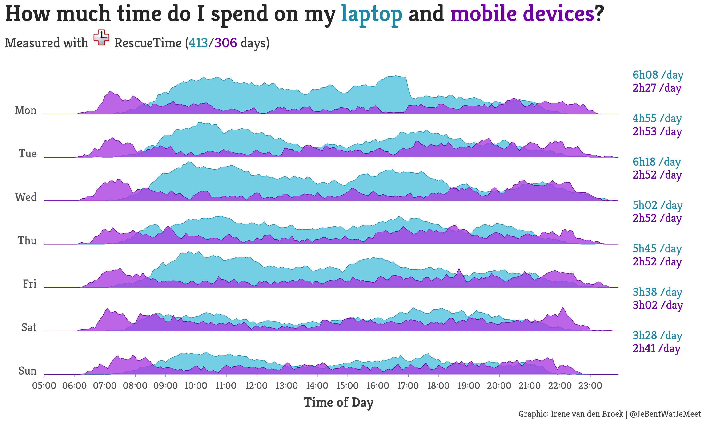

 

# RescueTime
Code for connecting, analyzing and visualizing Productivity Data measured with [RescueTime](https://www.rescuetime.com).  
You can find a complete Review about RescueTime (and a lot of data) on my [Website](https://www.jebentwatjemeet.nl) (in Dutch).

### Reactable with time spent on various programs, apps and websites

### Visualization of the [time spent on laptop and mobile devices](https://github.com/IreneVDB/RescueTime/tree/master/src) with `{ggridge}` and `{ggtext}`

### Infographic

### Visualization of Screen Time

### Visualization of Time on Mobile Devices

